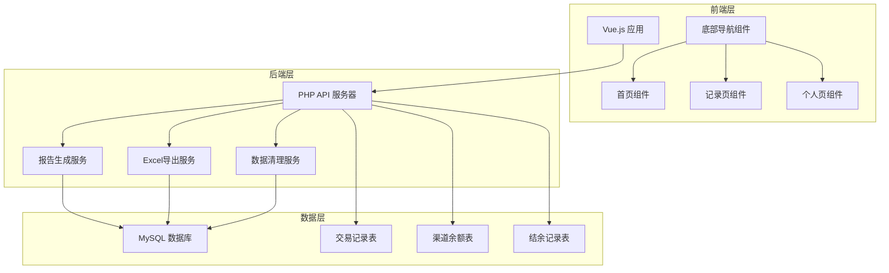

# 设计文档

## 概述

本设计文档详细描述了货币兑换系统完善功能的技术实现方案。系统将在现有架构基础上扩展财务报告功能、数据管理功能和前端界面优化。设计遵循现有的PHP后端和Vue.js前端架构，确保与现有系统的无缝集成。

## 架构

### 系统架构图



## 组件和接口

### 后端API接口设计

#### 1. 日结报告接口
```php
// POST /api/reports/daily-settlement
{
    "date": "2025-01-17",
    "action": "generate" // 或 "export"
}

// 响应
{
    "success": true,
    "data": {
        "channels": [
            {
                "channel_name": "Yh(V+支)",
                "yesterday_balance": 10000.00,
                "today_income_cny": 5000.00,
                "today_expense_cny": 2000.00,
                "current_balance": 13000.00,
                "today_income_hkd": 6000.00,
                "today_expense_hkd": 2400.00,
                "profit": 3600.00
            }
        ],
        "total_balance": 50000.00,
        "total_profit": 15000.00,
        "excel_url": "/exports/daily_settlement_20250117.xlsx"
    }
}
```

#### 2. 月结报告接口
```php
// POST /api/reports/monthly-settlement
{
    "year": 2025,
    "month": 1,
    "other_expenses": [
        {
            "name": "办公费用",
            "amount_hkd": 1000.00
        }
    ]
}

// 响应
{
    "success": true,
    "data": {
        "monthly_data": [
            {
                "date": "2025-01-01",
                "principal": 100000.00,
                "total_income": 50000.00,
                "total_expense": 30000.00,
                "profit": 20000.00
            }
        ],
        "other_expenses": 5000.00,
        "final_profit": 45000.00,
        "excel_url": "/exports/monthly_settlement_202501.xlsx"
    }
}
```

#### 3. 年结报告接口
```php
// POST /api/reports/yearly-settlement
{
    "year": 2025,
    "other_expenses": [
        {
            "name": "年度维护费",
            "amount_hkd": 10000.00
        }
    ]
}
```

#### 4. 数据清理接口
```php
// POST /api/data/cleanup
{
    "time_range": "month", // day, month, year, all
    "start_date": "2025-01-01",
    "end_date": "2025-01-31",
    "content_types": ["channels", "balances", "accounts", "bills", "locations"],
    "verification_password": "admin123"
}

// 响应
{
    "success": true,
    "message": "清空成功",
    "deleted_records": {
        "channels": 5,
        "balances": 100,
        "accounts": 20,
        "bills": 500,
        "locations": 10
    }
}
```

#### 5. 交易记录统计接口
```php
// GET /api/transactions/statistics?date=2025-01-17
{
    "success": true,
    "data": {
        "today_stats": {
            "total_count": 15,
            "total_income": 14453.00,
            "total_expense": 6455.99,
            "net_amount": 7997.01
        },
        "currency_top3": [
            {"currency": "HKD", "amount": 11222.00},
            {"currency": "USD", "amount": 1234.00},
            {"currency": "CNY", "amount": -4458.99}
        ],
        "channel_top3": [
            {"channel": "Yh(V+支)", "amount": 10110.99},
            {"channel": "Yh(支)", "amount": 5000.00},
            {"channel": "Lf(V+支)", "amount": 2333.00}
        ]
    }
}
```

### 前端组件设计

#### 1. 底部导航组件 (BottomNavigation.vue)
```vue
<template>
  <nav class="bottom-nav">
    <button 
      v-for="item in navItems" 
      :key="item.name"
      :class="{ active: currentRoute === item.route }"
      @click="navigateTo(item.route)"
    >
      {{ item.label }}
    </button>
  </nav>
</template>

<script>
export default {
  name: 'BottomNavigation',
  data() {
    return {
      navItems: [
        { name: 'home', label: '首页', route: '/home' },
        { name: 'records', label: '记录', route: '/records' },
        { name: 'profile', label: '个人', route: '/profile' }
      ]
    }
  },
  computed: {
    currentRoute() {
      return this.$route.path
    }
  },
  methods: {
    navigateTo(route) {
      this.$router.push(route)
    }
  }
}
</script>
```

#### 2. 记录页组件 (RecordsPage.vue)
```vue
<template>
  <div class="records-page">
    <header class="page-header">
      <div class="logo">兑换系统</div>
      <div class="user">
        {{ userName }} 
        <a href="#" @click="logout">退出</a>
      </div>
    </header>

    <h1>我的交易记录</h1>

    <section class="stats-card">
      <div class="stats-top">
        <div>总笔数：{{ todayStats.total_count }}</div>
        <div>入账：${{ todayStats.total_income.toFixed(2) }}</div>
        <div>出账：${{ todayStats.total_expense.toFixed(2) }}</div>
        <div>净额：${{ todayStats.net_amount.toFixed(2) }}</div>
      </div>
      <div class="stats-bottom">
        <div>
          <h3>按货币 Top3</h3>
          <div v-for="item in currencyTop3" :key="item.currency">
            {{ item.currency }} ${{ item.amount.toFixed(2) }}
          </div>
        </div>
        <div>
          <h3>按渠道 Top3</h3>
          <div v-for="item in channelTop3" :key="item.channel">
            {{ item.channel }} ${{ item.amount.toFixed(2) }}
          </div>
        </div>
      </div>
    </section>

    <section class="txn-list">
      <article v-for="transaction in transactions" :key="transaction.id">
        <div>{{ transaction.type }} {{ transaction.channel }} {{ transaction.currency }}{{ transaction.amount.toFixed(2) }}</div>
        <div>{{ transaction.datetime }} 编号 {{ transaction.transaction_id }}</div>
        <div v-if="transaction.remarks">备注：{{ transaction.remarks }}</div>
        <div>状态：{{ transaction.status }}</div>
        <div v-if="transaction.transaction_label" class="transaction-label">
          类型：{{ transaction.transaction_label }}
        </div>
      </article>
    </section>
  </div>
</template>
```

## 数据模型

### 数据库表结构扩展

#### 1. 交易记录表扩展 (transactions)
```sql
ALTER TABLE transactions ADD COLUMN transaction_label VARCHAR(50) DEFAULT NULL COMMENT '交易类型标签（如：即时买断）';
ALTER TABLE transactions ADD INDEX idx_transaction_label (transaction_label);
```

#### 2. 结余记录表 (balance_carry_forward)
```sql
CREATE TABLE balance_carry_forward (
    id INT PRIMARY KEY AUTO_INCREMENT,
    channel_id INT NOT NULL,
    date DATE NOT NULL,
    balance_cny DECIMAL(15,2) NOT NULL COMMENT '人民币余额',
    created_at TIMESTAMP DEFAULT CURRENT_TIMESTAMP,
    updated_at TIMESTAMP DEFAULT CURRENT_TIMESTAMP ON UPDATE CURRENT_TIMESTAMP,
    UNIQUE KEY unique_channel_date (channel_id, date),
    FOREIGN KEY (channel_id) REFERENCES channels(id)
);
```

#### 3. 其他支出记录表 (other_expenses)
```sql
CREATE TABLE other_expenses (
    id INT PRIMARY KEY AUTO_INCREMENT,
    period_type ENUM('monthly', 'yearly') NOT NULL,
    period_value VARCHAR(10) NOT NULL COMMENT '202501 或 2025',
    expense_name VARCHAR(100) NOT NULL,
    amount_hkd DECIMAL(15,2) NOT NULL,
    created_at TIMESTAMP DEFAULT CURRENT_TIMESTAMP,
    INDEX idx_period (period_type, period_value)
);
```

#### 4. 数据清理日志表 (cleanup_logs)
```sql
CREATE TABLE cleanup_logs (
    id INT PRIMARY KEY AUTO_INCREMENT,
    operator VARCHAR(50) NOT NULL,
    time_range VARCHAR(20) NOT NULL,
    start_date DATE,
    end_date DATE,
    content_types JSON NOT NULL,
    deleted_records JSON NOT NULL,
    created_at TIMESTAMP DEFAULT CURRENT_TIMESTAMP
);
```

## 错误处理

### 错误代码定义
```php
class ErrorCodes {
    const SUCCESS = 0;
    const INVALID_PARAMETER = 1001;
    const UNAUTHORIZED = 1002;
    const VERIFICATION_FAILED = 1003;
    const DATA_NOT_FOUND = 1004;
    const EXPORT_FAILED = 1005;
    const DATABASE_ERROR = 1006;
    const CLEANUP_FAILED = 1007;
}
```

### 错误响应格式
```json
{
    "success": false,
    "error_code": 1003,
    "message": "二次验证密码错误",
    "details": {
        "field": "verification_password",
        "reason": "密码不匹配"
    }
}
```

## 测试策略

### 单元测试
- PHP后端API接口测试
- Vue.js组件单元测试
- 数据库操作测试

### 集成测试
- 前后端接口集成测试
- Excel导出功能测试
- 数据清理功能测试

### 用户验收测试
- 日结月结年结报告生成测试
- 底部导航功能测试
- 交易记录页面显示测试
- 数据清理安全性测试

### 测试用例示例

#### 日结功能测试
```php
public function testDailySettlement() {
    // 准备测试数据
    $this->createTestTransactions();
    
    // 执行日结
    $response = $this->post('/api/reports/daily-settlement', [
        'date' => '2025-01-17',
        'action' => 'generate'
    ]);
    
    // 验证响应
    $this->assertTrue($response['success']);
    $this->assertArrayHasKey('total_balance', $response['data']);
    $this->assertArrayHasKey('total_profit', $response['data']);
    
    // 验证结余记录已保存
    $this->assertDatabaseHas('balance_carry_forward', [
        'date' => '2025-01-17'
    ]);
}
```

#### 即时买断标签测试
```php
public function testInstantBuyoutLabel() {
    // 创建即时买断交易
    $this->createInstantBuyoutTransaction();
    
    // 验证两条记录都有正确标签
    $this->assertDatabaseHas('transactions', [
        'transaction_type' => 'income',
        'transaction_label' => '即时买断'
    ]);
    
    $this->assertDatabaseHas('transactions', [
        'transaction_type' => 'expense',
        'transaction_label' => '即时买断'
    ]);
}
```