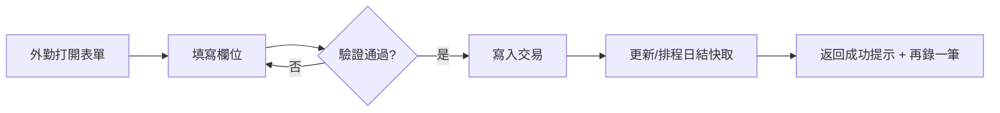
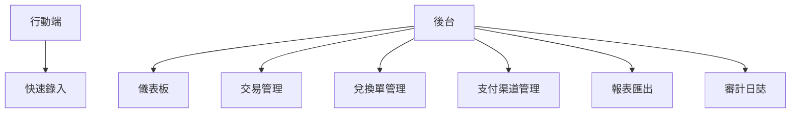
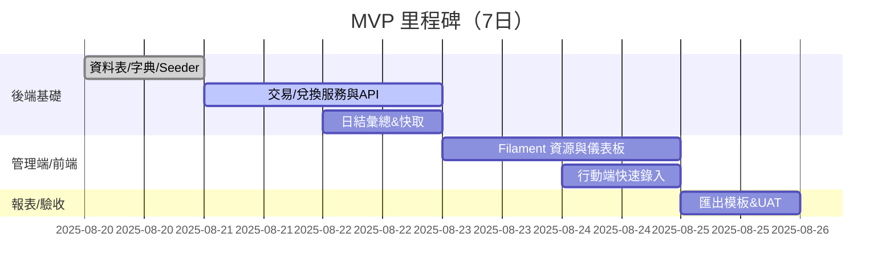

以下內容一次性給你三份文件的完整初稿：**《產品需求文檔（PRD）》、《產品與交互設計文檔（Design Spec）》、《技術設計文檔（Tech Spec）》**。均以你提供的 Excel 與下拉清單（=支付渠道）為依據，並預留少量「TBD」欄位供你日後補充。

---

# 一、《產品需求文檔（PRD）》

## 1. 項目背景

* 客戶：澳門本地港幣/人民幣兌換點。
* 核心痛點：外勤業務人員在外即時錄入**入帳/出帳**，系統需**當日實時統計**，並支持**月結/年結匯出**與對帳。
* 現狀：以 Excel 模板記錄；下拉清單表示**支付渠道**；存在格式不一、彙總手動成本高的問題。

## 2. 目標與範圍

* 目標：在 1–2 週內交付可用 MVP，支持：

  1. 外勤行動端**快速錄入**（入/出、幣種、金額、支付渠道、備註、經手人）。
  2. 後台管理端（近似 Excel 的表格視圖、篩選、行內編輯、匯出報表）。
  3. 日結/月結/年結的統計與匯出（欄位順序對齊現有模板）。
  4. 字典主檔：**支付渠道**（由你提供的下拉清單初始化）。
* 非目標（首期不含）：會計總帳整合、AML/KYC 流程、自動對銀行流水（可於後續版本加入）。

## 3. 角色與權限

* **Staff（外勤人員）**：錄入交易、僅查自己當日記錄。
* **Auditor（審核/對帳）**：查詢全量、匯出報表、不可刪除他人記錄。
* **Admin（管理員）**：全權，含字典維護、批次匯入/匯出、審計日誌檢視。

## 4. 核心流程

1. 外勤錄入 → 後端校驗 → 寫入交易表 → 觸發/排程更新日結快取。
2. 兌換單（可選）→ 一次操作產生兩條分錄（CNY OUT + HKD IN 或反之）→ 關聯同一 Transfer 單。
3. 後台查詢/篩選/行編 → 匯出模板（當日、月結、年結）。

## 5. 功能清單與需求細節

### 5.1 交易錄入（行動端）

* 欄位：日期時間(預設現在)、入/出、幣種(HKD/CNY)、金額、支付渠道(下拉)、備註、地點(可選)、經手人自動綁定。
* 體驗：大按鈕、可鍵盤輸入、**保存後保留上次幣種/渠道**以便連續錄入。
* 校驗：金額>0；幣種必選；渠道必選；日期不得超出允許範圍（TBD：可否補錄歷史）。

### 5.2 兌換單（可選開）

* 欄位：from\_currency、to\_currency、from\_amount、rate 或 to\_amount、備註、地點、經手人。
* 行為：同時生成兩條交易分錄並綁定同一 transfer\_id，確保對帳平衡。

### 5.3 後台管理（近似 Excel）

* 表格視圖：日期、入/出、幣種、金額、渠道、經手人、地點、備註；
* 功能：多條件篩選、日期區間、行內編輯、批量操作、Excel 匯出、（可選）Excel 匯入。
* Widget：今日入/出/淨額（按幣種）、渠道 Top-N、月度走勢。

### 5.4 報表與匯出

* **日結**：日期×幣種×渠道（入、出、淨額、期初/期末）。
* **月結/年結**：按日結聚合，匯出對齊現行 Excel 模板（工作表命名、欄位順序、格式）。
* 時區：Asia/Macau；金額精度：2 位；匯率：6 位。

### 5.5 字典與主數據

* 支付渠道：以你提供的 27 條列表初始化；保留括號內原始標籤（如「V」「支」「工行」「V+支」）以備後續分類。
* 幣種：HKD、CNY。
* 地點：可後續加入（門店/櫃枱/外勤點位）。

## 6. 非功能需求（NFR）

* **性能**：單日 ≤ 5 千筆可秒級查詢；表格翻頁<1s。
* **可靠**：所有變更有審計；失敗顯示可理解錯誤。
* **安全**：角色權限、Token 認證、重要操作審計（刪除、修改）。
* **可維運**：環境 .env、資料庫遷移、健康檢查、簡易備份指南。
* **本地化**：繁體為主，後台留多語擴展點。

## 7. 驗收標準（示例）

* 外勤 10 筆連續錄入耗時 ≤ 90 秒且無資料遺失。
* 日結與 Excel 版人工統計結果一致（允許四捨五入差額 ≤ 0.01）。
* 渠道僅可從下拉選擇，不可自由輸入。
* 匯出 Excel 與現有模板欄位順序一致，能被客戶既有流程直接使用。

---

# 二、《產品與交互設計文檔（Design Spec）》

## 1. 資訊架構

* 行動端：**快速錄入**（首頁即表單）。
* 後台（Filament）：儀表板、交易管理、兌換單管理（可選）、支付渠道字典、報表匯出、審計日誌。

## 2. 表單規格

| 欄位   | 類型         | 規則            | 備註       |
| ---- | ---------- | ------------- | -------- |
| 發生時間 | 日期時間       | 必填；預設現在       | 可補錄（TBD） |
| 入/出  | 單選 IN/OUT  | 必填            | 大按鈕切換    |
| 幣種   | 單選 HKD/CNY | 必填            | 可預設上次選擇  |
| 金額   | 數值(2位)     | 必填；>0；上限(TBD) | 自動千分位    |
| 支付渠道 | 下拉         | 必填；選項來自主檔     | 支持搜尋     |
| 地點   | 下拉         | 選填            | 之後可做報表分組 |
| 備註   | 文本         | ≤255          | 可掃描小票號   |

## 3. 交互細節

* 保存後出現\*\*“再錄一筆”**與**“返回列表”\*\*；再錄沿用幣種/渠道。
* 離線草稿（可選）：localStorage 暫存未送出的表單。
* 後台表格：支援**行內編輯**金額/備註/渠道；批量刪除（需高權限）。

## 4. 報表版面

* 日結 Widget：今日 HKD、CNY 的入/出/淨額卡片 + 渠道柱狀圖。
* 匯出：提供「日結匯出」「月結匯出」「年結匯出」三顆按鈕；檔名含日期區間。

## 5. 權限與導覽

* Staff：只看到「快速錄入」「我的交易」。
* Auditor：增加「交易管理」「匯出」。
* Admin：增加「渠道管理」「審計日誌」「系統設定」。

## 6. 原型/流程圖（Mermaid）

### 6.1 錄入流程（簡化）



### 6.2 資訊架構



---

# 三、《技術設計文檔（Tech Spec）》

## 1. 技術棧與組件

* **後端**：PHP 8.2+、**Laravel 11**、MySQL 8 / MariaDB 10.5+
* **管理端**：**Filament v3**（Livewire, Alpine）
* **行動端錄入**：Blade + Livewire（響應式）
* **套件**：spatie/laravel-permission、spatie/laravel-activitylog、maatwebsite/excel
* **部署**：Nginx + PHP-FPM；.env 管理；時區 `Asia/Macau`。

## 2. 系統架構圖

```mermaid
flowchart LR
  U[外勤使用者(手機)] -->|HTTPS| W[Web App (Laravel)]
  A[管理端(Filament)] -->|HTTPS| W
  W --> DB[(MySQL)]
  W --> LOG[Activity Log]
  W --> CACHE[(Cache/Queue)]
  W --> XLS[Excel Export]
```

## 3. 資料模型（概要 ERD）

```mermaid
erDiagram
  CURRENCIES ||--o{ TRANSACTIONS : "currency_id"
  PAYMENT_CHANNELS ||--o{ TRANSACTIONS : "payment_channel_id"
  USERS ||--o{ TRANSACTIONS : "user_id"
  LOCATIONS ||--o{ TRANSACTIONS : "location_id"
  TRANSFERS ||--o{ TRANSACTIONS : "transfer_id"

  CURRENCIES {
    int id
    string code
    string name
  }
  PAYMENT_CHANNELS {
    int id
    string name
    string base_name
    string tag_raw
    string suffix_note
    json   tags
    bool   enabled
    int    sort
  }
  TRANSACTIONS {
    int id
    datetime occurred_at
    enum type  // IN|OUT
    decimal amount
    decimal rate
    string ref_no
    string note
    fk currency_id
    fk payment_channel_id
    fk user_id
    fk location_id
    fk transfer_id
  }
  TRANSFERS {
    int id
    datetime occurred_at
    fk from_currency_id
    fk to_currency_id
    decimal from_amount
    decimal to_amount
    decimal rate
    fk user_id
    fk location_id
    string note
  }
  LOCATIONS {
    int id
    string name
  }
```

## 4. 資料字典與校驗

* 金額 `DECIMAL(14,2)`；匯率 `DECIMAL(14,6)`；日期以伺服器時區入庫。
* 校驗規則：

  * `type` ∈ {IN, OUT}；`amount` > 0；`currency_id`、`payment_channel_id` 必填有效。
  * 刪除交易需具備 Admin 或特權並寫入審計。
* 支付渠道初始化：採用你提供的 27 條；保留 `tag_raw` 與 `tags`，便於日後映射（例如 V=Visa? 支=支付? 工行=銀行別? —— **暫不猜測，僅保存**）。

## 5. 關鍵業務服務

### 5.1 交易服務 `TransactionService`

* `create(array $payload)`: 寫入交易、觸發日結更新（同步或 queue）。
* `update(...)`/`delete(...)`: 權限檢查 + 審計。

### 5.2 兌換服務 `TransferService`

* `create(from_currency, to_currency, from_amount, rate|to_amount)`

  * 產生 2 條 `transactions`：From 幣 OUT、To 幣 IN；關聯同一 `transfer_id`。
  * 確保 `to_amount = round(from_amount * rate, 2)`；避免精度誤差。

### 5.3 彙總服務 `LedgerService`

* `rebuildDaily(date)`：重算 `day_ledgers`（用於修正/批量匯入後）。
* 查詢：按日期/幣種/渠道聚合。

## 6. API 規範（節選）

* `POST /api/transactions`

  * Req：`occurred_at`, `type`(IN/OUT), `currency_id`, `amount`, `payment_channel_id`, `note?`, `location_id?`
  * Res：`{id, occurred_at, ...}`
* `POST /api/transfers`

  * Req：`occurred_at`, `from_currency_id`, `to_currency_id`, `from_amount`, `rate?`, `to_amount?`, `note?`
* `GET /api/summary/daily?date=YYYY-MM-DD`

  * Res：按幣種×渠道的入/出/淨額陣列
* `GET /api/export/monthly?month=YYYY-MM` → 回傳 Excel 檔

> 身份驗證採 Laravel Sanctum；角色授權採 spatie/permission。

## 7. 後台（Filament）資源

* **TransactionsResource**：表單（同 PRD 規格）、表格（行內編輯、篩選、匯出）、批次動作。
* **PaymentChannelResource**：主檔 CRUD；可視化 base\_name / tag\_raw / tags；啟用/停用/排序。
* **TransfersResource**（可選）：兌換單檢視與關聯交易。
* **Dashboard Widgets**：今日卡片、渠道 Top-N、月度走勢圖。

## 8. 審計與安全

* 全量寫入 `activitylog`（含操作人、欄位差異、時間）。
* 重要操作（刪除、批量修改）需二次確認 + 角色限制。
* 伺服器：HTTPS、強密碼策略、DB 最小權限、每日自動備份（保留 7–14 天）。

## 9. 部署與運維

* 環境：Nginx + PHP-FPM + MySQL；時區 `Asia/Macau`；語言 `zh_TW`。
* .env：DB、APP\_KEY、LOG\_CHANNEL、QUEUE\_CONNECTION（database/redis）。
* 例行：`php artisan migrate --force`、`php artisan storage:link`、`php artisan config:cache`。
* 監控：Laravel Telescope（僅內網）、Nginx/DB 指標；Logrotate。

## 10. 測試計畫（要點）

* 單元：服務層（交易、兌換、彙總）；
* 介面：API 驗證、權限、邊界（0/負數/超額）；
* UAT：

  * 與 Excel 範例核對同一日統計一致；
  * 連續 100 筆錄入無丟失；
  * 匯出檔能直接被現行流程使用。

## 11. 里程碑（建議）



---

## 附：初始「支付渠道」主檔導入原則

* 以你提供的 27 條完整字串作為 `name`；
* `base_name` 取括號前主體（示例：`Lf(V+支)` → `Lf`）；
* `tag_raw` 取括號內（示例：`V+支`）；同時解析為 `tags` JSON（\["V","支"]）；
* 保留 `suffix_note`（如「一啟」）；
* 後續若需把 `V/支/工行`標準化到**支付方式/銀行別**等維度，增設映射字典即可，無需變更交易資料。

---

### 你接下來可以：

1. 把本稿作為「招開發/內部同步」基礎文檔；
2. 若需，我可以把**完整的 Filament 資源檔（Transaction/PaymentChannel）**與**匯出 Controller 範例**直接生成，或把本三份文檔輸出為 **Word/Markdown 可下載**版本。
3. 如要把 `V/支/工行`做正式分類，告訴我映射規則（例如：V=Visa、支=支付寶/公司支出、工行=銀行別），我會補上字典與報表分組。
